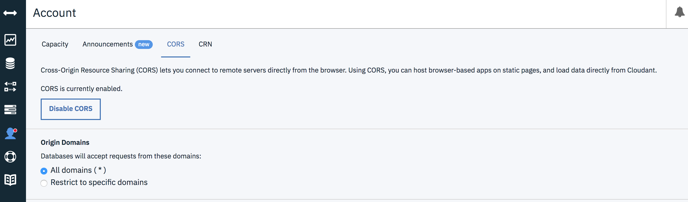
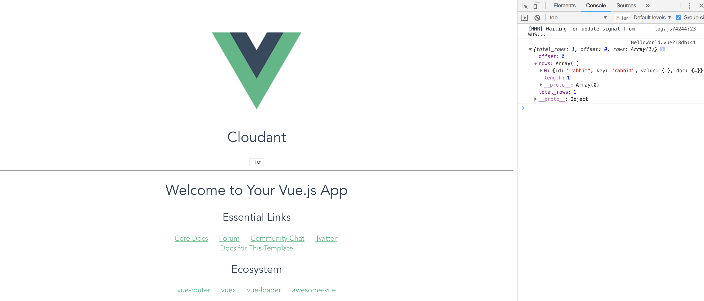

# cloudant-cors-test

## はじめに
ブラウザから Cloudant への直接アクセスを検証するためのプロジェクトです。

## Cloudant 設定
* alice というデータベースを作成しました。
* rabbit という文書を作成しました。
* CORS の設定は以下です。


## Cloudant アクセス
* HelloWorld.vue の list メソッド に接続情報を含めて、全文書を取得する処理を記述してます。
* ブラウザから List ボタンをクリックすると、コンソールに結果が表示されます。


## まとめ
* ブラウザから簡単に Cloudant アクセスするために、`pouchdb-browser` ライブラリーを使用しました。
  - 従来 Node.js でよく使っている `@cloudant/cloudant` は webpack (babel?) と相性が悪いのか、コンストラクター呼出しでエラーになりました。(単体で実行できる Node.js のプログラムは getRabbit.js です。)

## Build Setup

``` bash
# install dependencies
npm install

# serve with hot reload at localhost:8080
npm run dev

# build for production with minification
npm run build

# build for production and view the bundle analyzer report
npm run build --report

# run unit tests
npm run unit

# run e2e tests
npm run e2e

# run all tests
npm test
```

For a detailed explanation on how things work, check out the [guide](http://vuejs-templates.github.io/webpack/) and [docs for vue-loader](http://vuejs.github.io/vue-loader).
